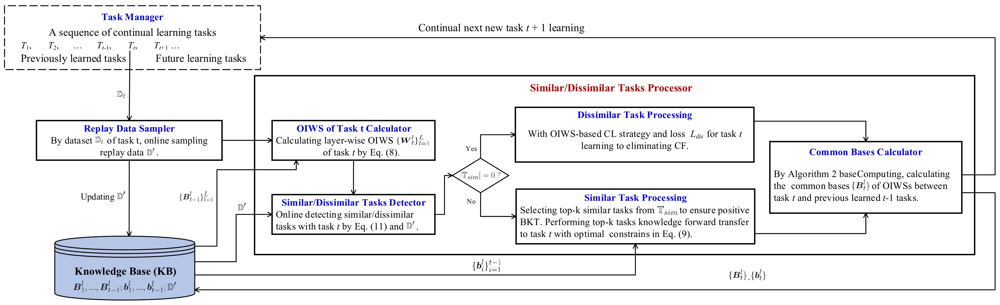

# Continual Learning with Orthogonal Weights and Knowledge Transfer

## Introduction
This repository contains the offical code for the paper 'Continual Learning with Orthogonal Weights and Knowledge Transfer'.

Orthogonal projection has been shown highly effective at overcoming *catastrophic forgetting* (CF) in continual learning (CL). Existing orthogonal projection methods are *all* based on *orthogonal gradients* (OG) between tasks. However, this paper shows theoretically that OG cannot guarantee CF elimination, which is a major limitation of the existing OG-based CL methods. Our theory further shows that only the *weight/parameter-level orthogonality* between tasks can guarantee CF elimination as the final classification is computed based on the network weights/parameters only. Existing OG-based methods also have two other *inherent limitations*, i.e., *over-consumption of network capacity* and *limiting knowledge transfer* (KT) across tasks. KT is also a core objective of CL. This paper then proposes a novel *weight-level orthogonal projection* method (called STIL), which ensures that each task occupies a weight subspace that is orthogonal to those of the other tasks. The method also addresses the two other limitations of the OG-based methods. Extensive evaluations show that the proposed STIL not only overcomes CF better than baselines, but also, perhaps more importantly, performs KT much better than them.



## Environments

```bash
conda create -n [your_env_name] python=3.9
conda activate [your_env_name]
pip install -r requirements.txt
```

## Training and Testing

In the following, we show how to train and test the proposed method SATCL on eleven different datasets for continual learning.

### PMNIST

```bash
python main_pmini.py
```

### CIFAR-100

```bash
python main_cifar100.py
```

### CIFAR-100 Superclass

```bash
python main_cifar100_sup.py
```

### MiniImageNet

```bash
python main_mini_imagenet.py
```

### Five-Datasets

```bash
python main_five_datasets.py
```

### F-EMNIST-1

```bash
python main_femnist10.py
```

### F-EMNIST-2

```bash
python main_femnist35.py
```

### F-CelebA-1

```bash
python main_celeba.py --n_tasks 10
```

### F-CelebA-2

```bash
python main_celeba.py --n_tasks 20
```

### (EMNIST, F-EMNIST-1)

```bash
python main_mixemnist.py
```

### (CIFAR 100, F-CelebA-1)

```bash
python main_mixceleba.py
```


The parameter settings can be modified in each 'main_*.py' file. You can view the parameter descriptions in each file. The continual learning results will be printed on the terminal.

## Datasets
The data files are not included in the repository because they are too large. When you run the 'main_*.py' files, they will automatically download the data files from the internet and save them in this directory.

Note that, F-CelebA should be downloaded from [CelebA](http://mmlab.ie.cuhk.edu.hk/projects/CelebA.html) and follow the instruction  of [Leaf](https://github.com/TalwalkarLab/leaf).  Processed files are in **./data** folder


